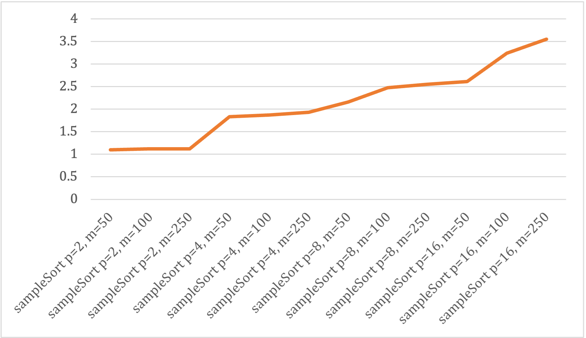
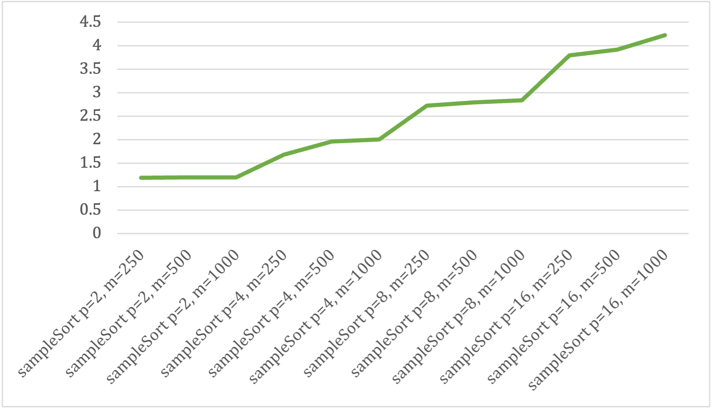

# Sample-Sort

---
## A simple parallel implementation of the sample sort algorithm in Julia.

This solution uses functions like append!() and push!() and other Julia commodities to make the code simpler and easier to understand at the cost of not being very memory efficient.\
Still, decent speedup values were observed with large arrays and are included below.

---

## The Algorithm As Implemented:
### Inputs:
- Array of elements 'a' of size 'n'
- Size of sample 'm'

### Steps:
- **Step 1:** The parent thread randomly picks a sample array 's' of size 'm' from the array 'a'.
- **Step 2:** The parent thread divides the sample 's' into 'p' sub-arrays of equal size by choosing splitters / dividers.
- **Step 3:** Launch 'p' threads each working on a sub-array of size 'n'/'p'. Each thread will divide its sub-array into p sub-groups based on the splitters / dividers. Once all threads have returned, the sub-groups of each thread are combined to form the final 'p' arrays to be sorted by 'p' threads.
- **Step 4:** Launch 'p' threads each sorting an array. Once all threads have returned, the arrays are combined to form the final sorted array.

### Output:
- The sorted array of elements

---

## Speedup:
The testing was done on an Ubuntu, Skylake Intel Xeon based cluster with plenty of headroom.\
The execution times were obtained using the Julia BenchmarkTools package's @btime macro.\
The speedup was calculated by dividing the execution time of the standard Julia sort function by the execution time of the sampleSort function.

---

### Results using an array 2^18 or 262,144 elements:

| Function               | Time (ms) | Speedup     |
|------------------------|-----------|-------------|
| Julia sort             | 16.609    | -           |
| sampleSort p=2, m=50   | 15.095    | 1.100298112 |
| sampleSort p=2, m=100  | 14.798    | 1.122381403 |
| sampleSort p=2, m=250  | 14.871    | 1.116871764 |
| sampleSort p=4, m=50   | 9.061     | 1.833020638 |
| sampleSort p=4, m=100  | 8.895     | 1.86722878  |
| sampleSort p=4, m=250  | 8.614     | 1.928140237 |
| sampleSort p=8, m=50   | 7.698     | 2.157573396 |
| sampleSort p=8, m=100  | 6.715     | 2.473417722 |
| sampleSort p=8, m=250  | 6.524     | 2.545830779 |
| sampleSort p=16, m=50  | 6.36      | 2.611477987 |
| sampleSort p=16, m=100 | 5.124     | 3.241412959 |
| sampleSort p=16, m=250 | 4.685     | 3.545144077 |

---

### Results using an array 2^20 or 1,048,576 elements:

| Function                 | Time (ms) | Speedup     |
|--------------------------|-----------|-------------|
| Julia sort               | 78.43     | -           |
| sampleSort p=2, m=250    | 65.963    | 1.188999894 |
| sampleSort p=2, m=500    | 65.478    | 1.197806897 |
| sampleSort p=2, m=1,000  | 65.693    | 1.193886715 |
| sampleSort p=4, m=250    | 46.843    | 1.674316333 |
| sampleSort p=4, m=500    | 40.037    | 1.958937982 |
| sampleSort p=4, m=1,000  | 39.249    | 1.998267472 |
| sampleSort p=8, m=250    | 28.825    | 2.720901995 |
| sampleSort p=8, m=500    | 28.074    | 2.79368811  |
| sampleSort p=8, m=1,000  | 27.664    | 2.835092539 |
| sampleSort p=16, m=250   | 20.654    | 3.797327394 |
| sampleSort p=16, m=500   | 20.017    | 3.918169556 |
| sampleSort p=16, m=1,000 | 18.57     | 4.223478729 |

---
